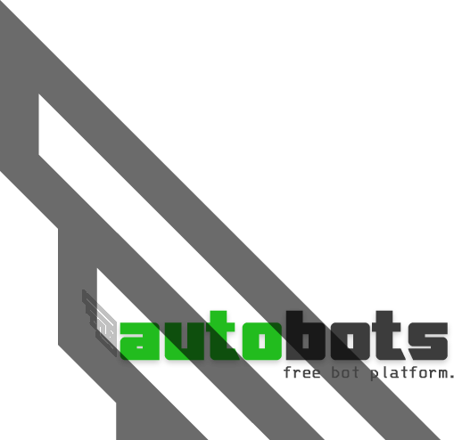

# Introduction

This is a guide on setting up and deploying a discord bot using [TypeScript](https://typescript.org) and [Discord.js](https://discord.js.org) and is intended for the beginner to intermediate level node.js developer.

