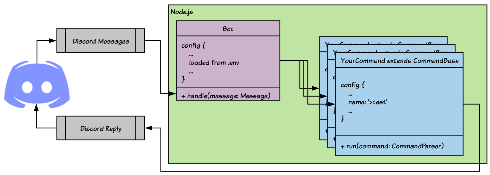

# Creating your own Module



## Setting up your node module

First we need to create a new directory and initialize our node package:



```bash
$ mkdir -p testbot-module-test/src
$ cd testbot-module-test
$ npm init
$ npm install -D typescript @types/node
$ npm install @autobot/common discord.js
```



## tsconfig.json

We need to tell the typescript command `tsc` how to compile our project. Create the following file in your project root and name it `tsconfig.json`:



```typescript
{
    "compilerOptions": {
        "target": "es6",
        "module": "commonjs",
        "lib": [
            "es5",
            "es6"
        ],
        "sourceMap": true,
        "outDir": "dist",
        "rootDir": "src",
        "noImplicitAny": true,
        "moduleResolution": "node",
        "experimentalDecorators": true,
        "emitDecoratorMetadata": true,
        "declaration": true
    },
    "include": [
        "src/**/*"
    ]
}
```



## Test Command Logic

Our `TestCommand` class will consist of constructor and run methods.   
It's important that our class extends the [CommandBase](https://github.com/autobots-rocks/autobot-common/blob/master/src/Common/CommandBase.ts) class! Create a file called `index.ts` in our modules `src/` directory.



```typescript
import { Command, CommandBase, CommandParser, Event } from '@autobot/common';
import { RichEmbed }                                  from 'discord.js';

/**
 * Demonstrates a simple command that replies to a test.
 * Example message: `>test`
 */
@Command
export class TestCommand extends CommandBase {

    public constructor() {

        //
        // Set this commands configuration.
        //
        super({

            event: Event.MESSAGE,
            name: '>test',
            group: 'testing',
            description: 'Simple test command that sends a reply.',

        });

    }

    /**
     * Called when a command matches config.name.
     *
     * @param command Parsed out commamd
     *
     */
    public run(command: CommandParser): void {

        command.obj.reply(new RichEmbed().setTitle('Test received!'));

    }

}
```




If you want to have multiple commands you can separate them into separate class files and export them in the `index.ts` file. The `index.ts` file is a "barrel file" that is called by `require()`


