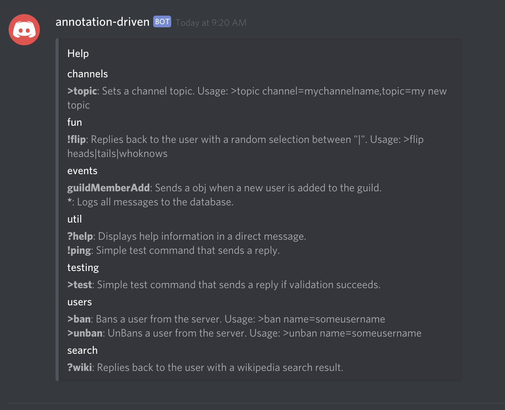

# HelpCommand




This command performs role checking and will only send the commands that the user has role\(s\) assigned for, if any.




```typescript
import { RichEmbed }     from 'discord.js';
import { BOT }           from '../Common/Bot';
import { CommandBase }   from '../Common/CommandBase';
import { Command }       from '../Common/CommandDecorator';
import { CommandParser } from '../Common/CommandParser';
import { Event }         from '../Common/Event';

/**
 * Displays help information in a direct message.
 * Will only display commands available to that user based on role(s).
 */
@Command
export class HelpCommand extends CommandBase {

    public constructor() {

        //
        // Set this commands configuration.
        //
        super({

            event: Event.MESSAGE,
            name: '?help',
            group: 'util',
            description: 'Displays help information in a direct message.',

        });

    }

    /**
     * Called when a command matches config.name.
     *
     * @param command Parsed out commamd
     *
     */
    public run(command: CommandParser): void {

        let groups: any = {};

        //
        // Loop through each registered command.
        //
        for (let i = 0; i < BOT.commands.length; i++) {

            let roleMatched = false;

            //
            // Perform role based validation.
            //
            if (BOT.commands[ i ].config.roles) {

                for (let j = 0; j < BOT.commands[ i ].config.roles.length; j++) {

                    if (command.obj.member.roles.find(role => role.name === BOT.commands[ i ].config.roles[ j ])) {
  
                        roleMatched = true;

                        break;

                    }

                }

            } else {

                roleMatched = true;

            }

            if (roleMatched) {

                if (!groups[ BOT.commands[ i ].config.group ]) {

                    groups[ BOT.commands[ i ].config.group ] = [];

                }

                groups[ BOT.commands[ i ].config.group ].push(`\t**${ BOT.commands[ i ].config.name }**: ${ BOT.commands[ i ].config.description }`);

            }

        }

        const embed = new RichEmbed().setTitle('Help');

        for (let key in groups) {

            embed.addField(key, groups[ key ].join("\n"));

        }

        command.obj.reply(`I sent you a direct message with the help information!`);

        // @ts-ignore
        command.obj.author.sendMessage(embed);

    }

}
```



