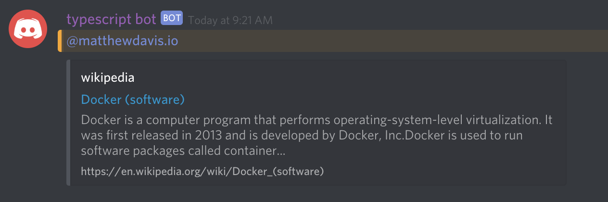

# WikipediaSearchCommand



Install wikijs with `npm install wikijs`first and then add the command below. Don't forget to update `/src/Commands/index.ts`!



```typescript
import { RichEmbed }     from "discord.js";
import wiki              from 'wikijs';
import { CommandBase }   from '../Common/CommandBase';
import { Command }       from '../Common/CommandDecorator';
import { CommandParser } from '../Common/CommandParser';
import { Event }         from '../Common/Event';

/**
 * Searches Wikipedia.
 * Example: ?wiki docker
 */
@Command
export class WikipediaSearchCommand extends CommandBase {

    public constructor() {

        //
        // Set this commands configuration.
        //
        super({

            event: Event.MESSAGE,
            name: '?wiki',
            description: 'Replies back to the user with a wikipedia search result.',

        });

    }

    /**
     * Called when a command matches config.name.
     *
     * @param command Parsed out commamd
     *
     */
    public async run(command: CommandParser) {

        const result = await wiki().find(command.arguments[ 0 ].name);

        const summary = await result.summary();
        const image = await result.mainImage();

        command.obj.reply(new RichEmbed().setAuthor('wikipedia')
                                         // @ts-ignore
                                         .setTitle(result.raw.title)
                                         .setDescription(`${ summary.substr(0, 200) }...`)
                                         // @ts-ignore
                                         .setURL(result.raw.fullurl)
                                         .setThumbnail(image)
                                         // @ts-ignore
                                         .setFooter(result.raw.fullurl));

    }

}
```



