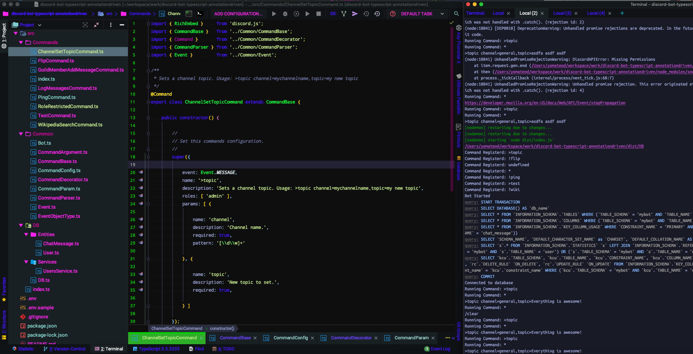

# Development Environment



## Using an IDE

There are several IDE's out there but I highly recommend either [Visual Studio Code](https://code.visualstudio.com/) or [WebStorm](https://www.jetbrains.com/webstorm).

## Install Node.js

We need to have node.js installed as it is our interpreter. Download node.js and install it from [http://nodejs.org](http://nodejs.org).

Once installed you can open your command prompt to verify \(windows users will need to re-login for the path to take effect\).

```bash
$ node -v
  v10.5.0
```


