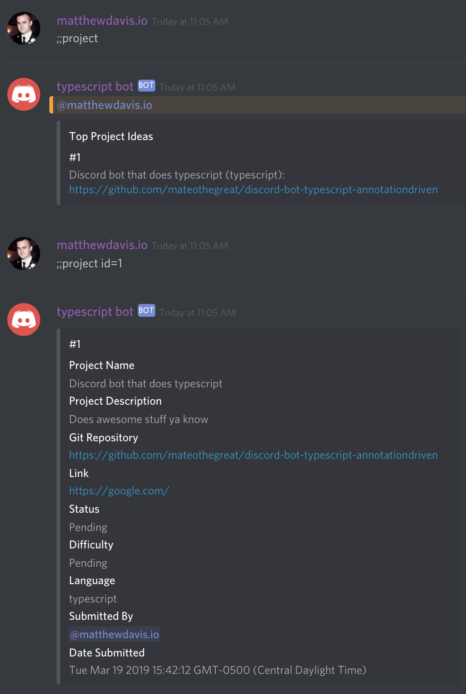

# Getting Started

This feature allows users to submit project ideas and vote on them. Projects are managed by moderators where they can then be approved and have a difficulty level associated with them.

