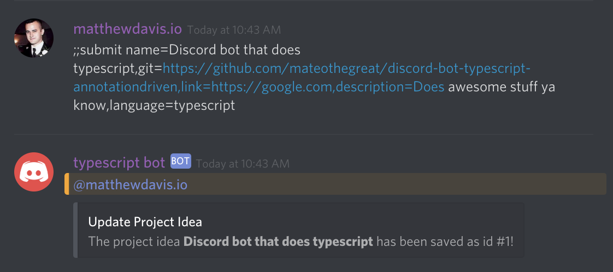

# ProjectAddCommand



Users can submit new project ideas with the following command:

```typescript
;;submit name=Discord bot that does typescript,git=https://github.com/mateothegreat/discord-bot-typescript-annotationdriven,link=https://google.com,description=Does awesome stuff ya know,language=typescript
```

Available Fields:

* Project Name
* Project Description
* Project Language
* Git Repository URL
* Homepage Link



```typescript
import { RichEmbed }     from 'discord.js';
import { CommandBase }   from '../Common/CommandBase';
import { Command }       from '../Common/CommandDecorator';
import { CommandParser } from '../Common/CommandParser';
import { Event }         from '../Common/Event';
import { DB }            from '../DB/DB';
import { ProjectIdea }   from '../DB/Entities/ProjectIdea';

/**
 * Replies back to the user with "pong!"
 */
@Command
export class ProjectAddCommand extends CommandBase {

    public constructor() {

        //
        // Set this commands configuration.
        //
        super({

            event: Event.MESSAGE,
            name: ';;submit',
            group: 'projects',
            description: 'Create a new project idea. Usage: ;;submit name=My Awesome Project,git=https://github.com/mateothegreat/discord-bot-typescript-annotationdriven',
            roles: [ 'Active' ],
            params: [

                {
                    name: 'name',
                    description: 'Project name.',
                    required: true

                }, {

                    name: 'language',
                    description: 'Project language (i.e.: javascript, kotlin, java).',
                    required: true

                }, {

                    name: 'git',
                    description: 'Git repository URL (must be publically available).',
                    required: true

                }, {

                    name: 'link',
                    description: 'Link to supporting documentation'

                }, {

                    name: 'description',
                    description: 'Project description/details.'

                }

            ]

        });

    }

    /**
     * Called when a command matches config.name.
     *
     * @param command Parsed out commamd
     *
     */
    public async run(command: CommandParser) {

        //
        // First we try to retrieve the project by gitrepo.
        //
        const result = await DB.connection.getRepository(ProjectIdea)
                               .createQueryBuilder('ProjectIdea')
                               .select([ '*' ])
                               .where('git = :git', { git: command.namedarguments.git })
                               .getRawOne();

        //
        // Project exists, so let's update it else we create a new one.
        //
        if (result) {

            result.name = command.namedarguments.name;
            result.language = command.namedarguments.language;
            result.description = command.namedarguments.description;
            result.git = command.namedarguments.git;
            result.link = command.namedarguments.link;

            DB.connection
              .createQueryBuilder()
              .update(ProjectIdea)
              .set(result)
              .where('id = :id', { id: result.id })
              .execute();

            command.obj.reply(new RichEmbed().setTitle('Update Project Idea').setDescription(`The project idea **${ command.namedarguments.name }** has been saved as id #${ result.id }!`));

        } else {

            const project: ProjectIdea = new ProjectIdea();

            project.from_userid = command.obj.author.id;
            project.from_username = command.obj.author.username;
            project.from_discriminator = command.obj.author.discriminator;

            project.name = command.namedarguments.name;
            project.language = command.namedarguments.language;
            project.description = command.namedarguments.description;
            project.git = command.namedarguments.git;
            project.link = command.namedarguments.link;

            DB.connection.manager.save(project).then(inserted => {

                command.obj.reply(new RichEmbed().setTitle('Submit Project Idea').setDescription(`The project idea **${ command.namedarguments.name }** has been submitted as id #${ inserted.id }!`));

            });

        }

    }

}
```



